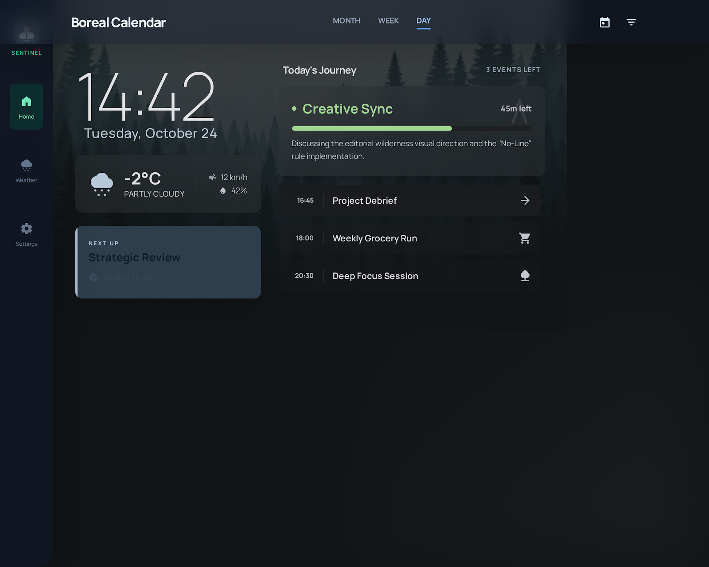

<!-- HERO -->
<p align="center">
  
</p>

<h1 align="center">Smart Display</h1>

<p align="center">
  A Raspberry Pi kiosk dashboard for the kitchen wall.<br>
  Family photos, weather, calendar, and an AI-generated daily briefing — all on a 1024×600 touchscreen.
</p>

<p align="center">
  <a href="#features">Features</a> ·
  <a href="#hardware">Hardware</a> ·
  <a href="#setup">Setup</a> ·
  <a href="#configuration">Configuration</a> ·
  <a href="#design">Design</a>
</p>

---

## Features

- **Ambient photo slideshow** — pulls from a local Plex photo library, or any folder of JPGs you drop into `public/photos/`.
- **Google Calendar** — merges multiple calendars into a single agenda. Day, week, and month views; auto-returns to today after inactivity.
- **Weather** — current conditions, 5-day forecast, and an hourly drill-down. Powered by [Open-Meteo](https://open-meteo.com) (no API key needed).
- **AI daily briefing** — Gemini reads the day's weather and calendar and writes a personalized morning summary. Highlights schedule conflicts with the forecast ("bring a jacket to the 4pm — temps drop after 3").
- **Home Assistant tile** — embeds your HA dashboard for quick lighting / thermostat / scene control.
- **Touch-first** — swipe between cards, tap to drill in. Designed for a single-purpose wall-mounted display.

## Hardware

Built and tested on:

- Raspberry Pi 4 (4 GB)
- 1024×600 HDMI touchscreen
- Raspberry Pi OS (Bookworm, Wayland)
- LightDM auto-login → Chromium kiosk

Anything that can run Node 18+ and Chromium will work — the layout is fixed to a 1024×600 viewport.

## Setup

```bash
git clone https://github.com/YOUR_USER/smart-display.git
cd smart-display
npm install
cp .env.example .env
# Edit .env — at minimum set LATITUDE, LONGITUDE, and CITY
npm start
```

Open `http://localhost:3000` in a browser. For the kiosk install on a Pi, see [`kiosk.sh`](kiosk.sh).

### Google Calendar (optional)

1. Create an OAuth2 client in [Google Cloud Console](https://console.cloud.google.com/) (Desktop app type).
2. Download the credentials JSON, save it as `credentials.json` in the project root.
3. Run the OAuth flow once locally to generate `token.json` (both files are gitignored).
4. List the calendar IDs you want to merge in `CALENDAR_IDS` (comma-separated).

### Gemini AI briefing (optional)

1. Get a key at [aistudio.google.com](https://aistudio.google.com/app/apikey).
2. Set `GEMINI_API_KEY` in `.env`.
3. Optionally personalize the prompt with `HOUSEHOLD_NAME` and `HOUSEHOLD_DESCRIPTION` — give the model context about who lives there (names, ages, interests) so the briefing reads naturally.

### Plex photos (optional)

If you have a Plex Media Server with a photo library, set `PLEX_URL`, `PLEX_TOKEN`, and `PLEX_PHOTO_SECTION_ID`. The slideshow will rotate through random albums. Otherwise, drop JPGs into `public/photos/` and they'll be served by the local photo router.

## Configuration

See [`.env.example`](.env.example) for the full list. Required vs optional:

| Variable | Required | Purpose |
|---|---|---|
| `LATITUDE`, `LONGITUDE`, `CITY` | yes | Weather + location context |
| `GOOGLE_APPLICATION_CREDENTIALS` | optional | Path to OAuth2 client JSON |
| `CALENDAR_IDS` | optional | Comma-separated calendar IDs |
| `GEMINI_API_KEY` | optional | Enables AI daily briefing |
| `HOUSEHOLD_NAME`, `HOUSEHOLD_DESCRIPTION` | optional | Personalizes the briefing |
| `PLEX_URL`, `PLEX_TOKEN`, `PLEX_PHOTO_SECTION_ID` | optional | Photo library source |

## Design

The dashboard layout was designed in Claude alongside the implementation. The `designs/` directory contains the reference mockups for each card:

| | |
|:---:|:---:|
|  |  |
| Day view | Week view |
|  |  |
| Month view | Weather |

Each folder has a `DESIGN.md` explaining the typography, spacing, and interaction rules — and a `code.html` you can open standalone to see the static layout.

The `simulator.html` at the project root runs the full UI in a browser with mocked data, useful for iterating on the design without a Pi.

## License

MIT — see [LICENSE](LICENSE).
